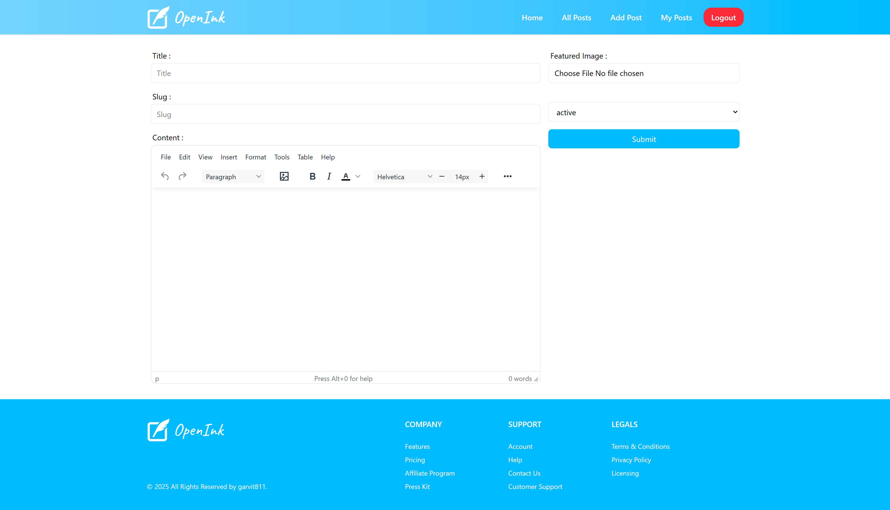

# ✒️ OpenInk


---

OpenInk is a **modern blogging platform** built with **React, Appwrite, Redux, and TailwindCSS**.  
It allows users to **sign up, log in, create, edit, delete, and browse blog posts** with a smooth and responsive UI.

---

## 🚀 Features

- 🔐 **Authentication** – Sign up, log in, log out with Appwrite  
- 📰 **Post Management** – Create, update, delete, and view posts  
- ✍️ **Rich Text Editor** – Write blogs with a full-featured editor (TinyMCE)  
- 🖼 **Image Uploads** – Add featured images via Appwrite storage  
- 👤 **My Posts** – Manage personal posts easily  
- 📱 **Responsive UI** – Built with TailwindCSS for a modern look  
- ⚡ **State Management** – Powered by Redux Toolkit  

---

## 🛠️ Tech Stack

- **Frontend:** React (Vite), TailwindCSS  
- **Backend & Auth:** Appwrite  
- **State Management:** Redux Toolkit  
- **Editor:** TinyMCE  
- **Form Handling:** React Hook Form  
- **HTML Parsing:** html-react-parser  

---

## 📂 Project Structure

<pre>
src/
├── appwrite/ # Appwrite services (auth, config)
├── assets/ # Static assets
├── components/ # Reusable UI components
├── conf/ # Configurations / env variables
├── pages/ # Pages (Home, AddPost, MyPosts, etc.)
├── store/ # Redux store & slices
├── App.jsx # Root component
├── main.jsx # Entry point
|── index.css # importing taiwind and setting fonts
</pre>

---

## ⚙️ Appwrite Setup

1. **Create an Appwrite Account**
    - Can create account with google or github.
2. **Create a New Project**
    - Go to your Appwrite Console
    - Click Create Project → name it (e.g. OpenInk)
3. **Create a Database & Collection**
    - Go to Databases → Create Database (e.g. BlogDB)
    - Inside it, create a Collection (e.g. Posts)
4. **Set up Storage (for Images)**
    - Go to Storage → Create Bucket (e.g. BlogImages)
    - Allow read/write permissions as required
5. **Assign Permissions**
    - Ensure Collections and Buckets allow read/write access for authenticated users

---

## 📝 TinyMCE Setup

1. **Create an TinyMCE Account**
    - Go to TinyMCE
    - Signup(free plan available)
2. **Get your API Key**
    - Get your API Key and copy it to .env file 

---

## ⚙️ Setup Instructions

1. **Clone the repository**
   ```bash
   git clone https://github.com/your-username/openink.git
   cd openink
   ```
2. **Install Dependencies**
   ```bash
   npm install
   ```
3. **Configure environment variables**
   ```bash
   VITE_APPWRITE_ENDPOINT=your_appwrite_endpoint
   VITE_APPWRITE_PROJECT_ID=your_project_id
   VITE_APPWRITE_DATABASE_ID=your_database_id
   VITE_APPWRITE_COLLECTION_ID=your_collection_id
   VITE_APPWRITE_BUCKET_ID=your_bucket_id

   VITE_TINY_MCE_API_KEY=your_tinymce_api_key

   ```
4. **Run the development server**
   ```bash
   npm run dev
   ```

---

## 📸 Screenshots

### Add Post Page


### All Posts Page
.png)

### SignUp Page
.png)

---

## 📜 License

    - This project is licensed under the MIT License.
    - You’re free to use and modify it with attribution.

---